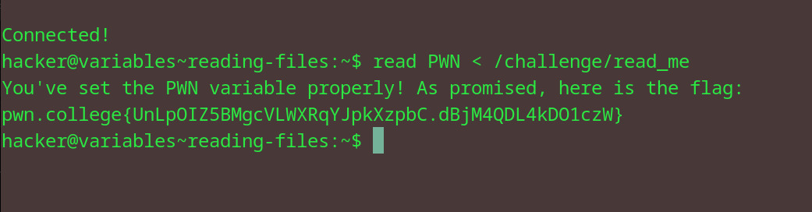

# Reading Files
## Question
Now, use that to read /challenge/read_me into the PWN environment variable, and we'll give you the flag! The /challenge/read_me will keep changing, so you'll need to read it right into the PWN variable with one command!

## Solution

followed instructions from the question

flag: pwn.college{UnLpOIZ5BMgcVLWXRqYJpkXzpbC.dBjM4QDL4kDO1czW}
