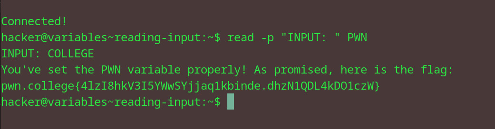

# Reading Input 
## Question
In this challenge, your job is to use read to set the PWN variable to the value COLLEGE. Good luck!

## Solution

followed instructions from the question

flag: pwn.college{4lzI8hkV3I5YWwSYjjaq1kbinde.dhzN1QDL4kDO1czW}
