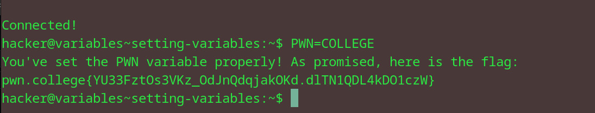

# Setting Variables
## Question
To solve this level, you must set the PWN variable to the value COLLEGE. Be careful: both the names and values of variables are case-sensitive! PWN is not the same as pwn and COLLEGE is not the same as College.

## Solution

followed instructions from the question

flag: pwn.college{YU33FztOs3VKz_OdJnQdqjakOKd.dlTN1QDL4kDO1czW}
