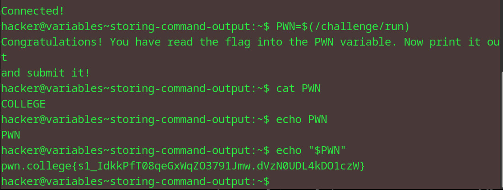

# Storing Cmd Output
## Question
Neat! Now, you practice. Read the output of the /challenge/run command directly into a variable called PWN, and it will contain the flag!

## Solution

followed instructions from the question

flag: pwn.college{s1_IdkkPfT08qeGxWqZO3791Jmw.dVzN0UDL4kDO1czW}
