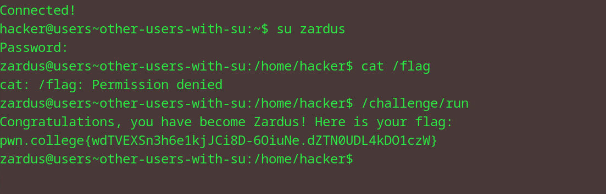

# Other uses with su
## Question
In this level, you must switch to the zardus user and then run /challenge/run. Zardus' password is dont-hack-me. Good luck!

## Solution

1. use su to get root access under zardus' name 
2. enter the password from the question 
3. cat the flag file to get flag

flag: pwn.college{wdTVEXSn3h6e1kjJCi8D-6OiuNe.dZTN0UDL4kDO1czW}

