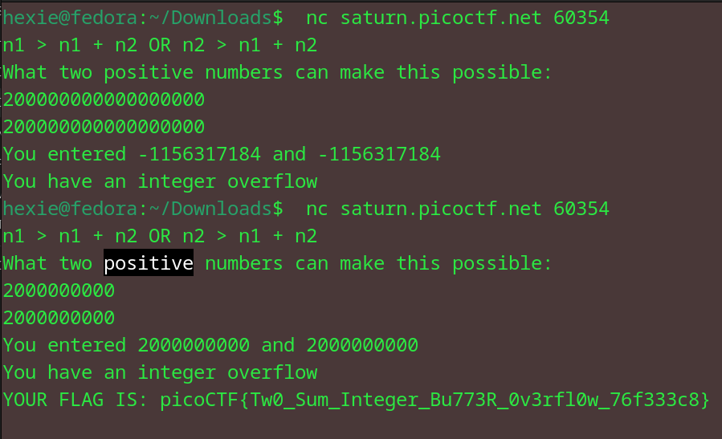

# two-sum
Can you solve this? What two positive numbers can make this possible: n1 > n1 + n2 OR n2 > n1 + n2.
Enter them here nc saturn.picoctf.net 52931

## Approach
Ran the netcat command on my terminal where my flag.c file was present. Tried to do basic integer overflow and it didn't work as expected.

Then, I noticed the word positive and decided to change my inputs to be positive as instructed. It worked and I could view the flag.

### flag: picoCTF{Tw0_Sum_Integer_Bu773R_0v3rfl0w_76f333c8}
