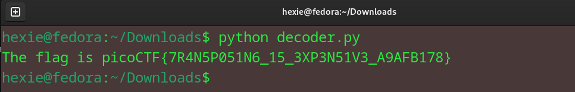

# transposition trial
Our data got corrupted on the way here. Luckily, nothing got replaced, but every block of 3 got scrambled around! The first word seems to be three letters long, maybe you can use that to recover the rest of the message. Download the corrupted message here.

message: heTfl g as iicpCTo{7F4NRP051N5_16_35P3X51N3_V9AAB1F8}7

## Approach
> heTfl g
This part looked like 'the flag'. So i got the basic idea of the flag, which is 'the flag is'.
Since I have been exploring the cryptography domain, I decided to try and write a script for it.
``` bash 
def main():
    with open("message.txt", "r", encoding="UTF-8") as f:
        txt = f.read()

    n = 3
    decoded_text = ''.join([txt[i + 2] + txt[i] + txt[i + 1] for i in range(0, len(txt), n)])
    print(decoded_text)

if __name__ == '__main__':
    main()
```
This is the output I got: 


### flag: picoCTF{7R4N5P051N6_15_3XP3N51V3_A9AFB178}
