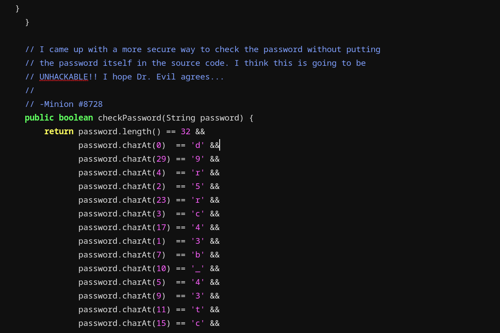

# vault door 1
This vault uses some complicated arrays! I hope you can make sense of it, special agent. The source code for this vault is here: VaultDoor1.java

> files given: VaultDoor1.java

## Approach
Opened java code in text editor and found a long array of 32 alphanumerals.

I could do it manually, but i had to practice writing codes anyway so i wrote this python code to concatenate the letters into a password.
``` bash
def get_password():
    password_data = [
        "password.charAt(0)  == 'd'",
        "password.charAt(29) == '9'",
        "password.charAt(4)  == 'r'",
        "password.charAt(2)  == '5'",
        "password.charAt(23) == 'r'",
        "password.charAt(3)  == 'c'",
        "password.charAt(17) == '4'",
        "password.charAt(1)  == '3'",
        "password.charAt(7)  == 'b'",
        "password.charAt(10) == '_'",
        "password.charAt(5)  == '4'",
        "password.charAt(9)  == '3'",
        "password.charAt(11) == 't'",
        "password.charAt(15) == 'c'",
        "password.charAt(8)  == 'l'",
        "password.charAt(12) == 'H'",
        "password.charAt(20) == 'c'",
        "password.charAt(14) == '_'",
        "password.charAt(6)  == 'm'",
        "password.charAt(24) == '5'",
        "password.charAt(18) == 'r'",
        "password.charAt(13) == '3'",
        "password.charAt(19) == '4'",
        "password.charAt(21) == 'T'",
        "password.charAt(16) == 'H'",
        "password.charAt(27) == '5'",
        "password.charAt(30) == '2'",
        "password.charAt(25) == '_'",
        "password.charAt(22) == '3'",
        "password.charAt(28) == '0'",
        "password.charAt(26) == '7'",
        "password.charAt(31) == 'e'"
    ]
    
    password_constraints = []
    for line in password_data:
        parts = line.split("==")
        position = int(parts[0].split("charAt(")[1].split(")")[0].strip())
        character = parts[1].strip().strip("'")
        password_constraints.append((position, character))
    
    password_constraints.sort()
    password = ''.join(char for _, char in password_constraints)
    return password

if __name__ == "__main__":
    print("The password is: picoCTF{" + get_password() + "}")
```

Got it :)

### flag: picoCTF{d35cr4mbl3_tH3_cH4r4cT3r5_75092e}
