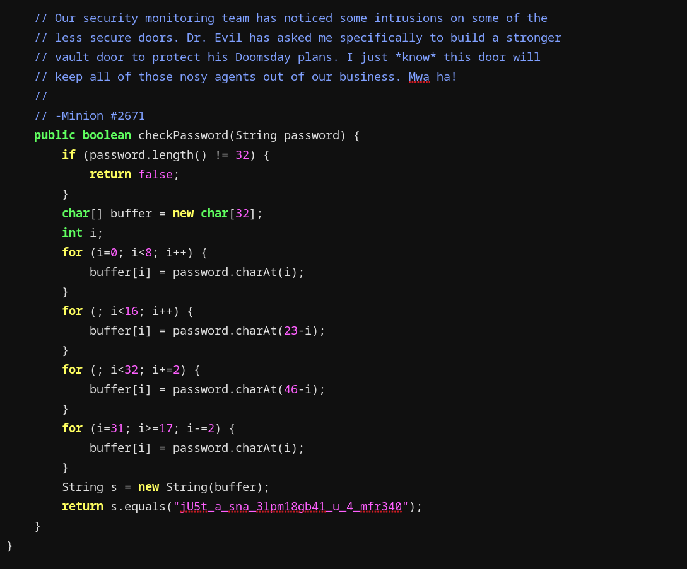
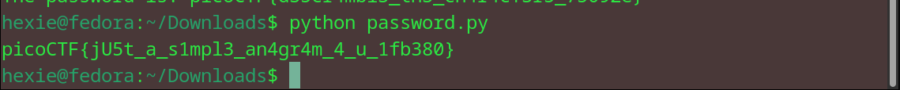

# vault door 3
This vault uses for-loops and byte arrays. The source code for this vault is here: VaultDoor3.java

> files given: VaultDoor3.java

## Approach
The given code had a certain string as a buffer as shown:

Wrote this python code to convert the anagram into a password:
``` bash
def get_password():
    s = "jU5t_a_sna_3lpm18gb41_u_4_mfr340"
    passwd = [''] * 32

    # Fill in the characters based on the given loops
    for i in range(8):
        passwd[i] = s[i]
    for i in range(8, 16):
        passwd[i] = s[23 - i]
    for i in range(16, 32, 2):
        passwd[i] = s[46 - i]
    for i in range(31, 16, -2):
        passwd[i] = s[i]

    return ''.join(passwd)

if __name__ == "__main__":
    print("picoCTF{" + get_password() + "}")
```

Got the flag <3

### flag: picoCTF{jU5t_a_s1mpl3_an4gr4m_4_u_1fb380}

