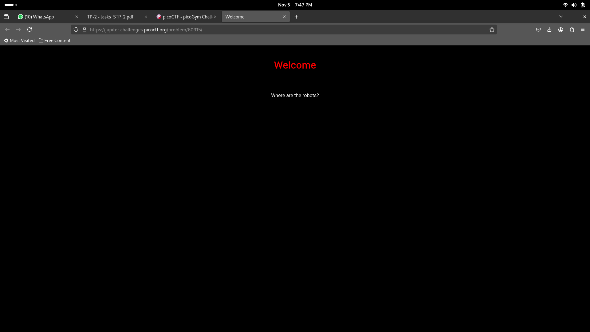
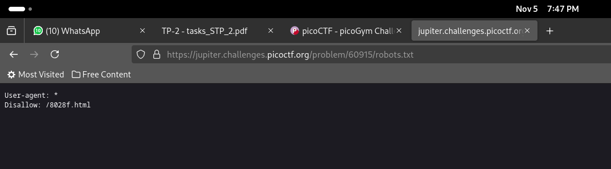
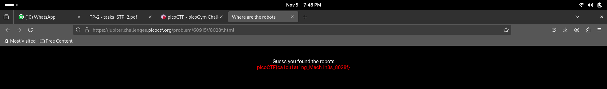

# where are the robots
Can you find the robots? [link](https://jupiter.challenges.picoctf.org/problem/60915/)

## Approach

You're greeted with a webpage as given. You can use robots.txt which is a text file that instructs web crawlers and other robots which parts of a website they can access. Appending that at the end of the url of the webpage gives you the following screen.

You can see that, from this page, the website creator has disallowed the user access to /8028f.html. We can use that to exploit the website.

The flag can be obtained by appending the disallowed part to the url. 

### flag: picoCTF{ca1cu1at1ng_Mach1n3s_8028f}
