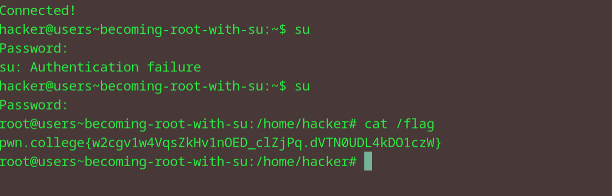

# Becoming Root with su
## Question
But THIS challenge (and only this challenge) does have a root password. That password is hack-the-planet, and you must provide it to su to become root! Go do that, and read the flag!

## Solution

1. use su to get root access
2. enter the password as required from the question
3. cat the flag file to get flag

flag: pwn.college{w2cgv1w4VqsZkHv1nOED_clZjPq.dVTN0UDL4kDO1czW}

