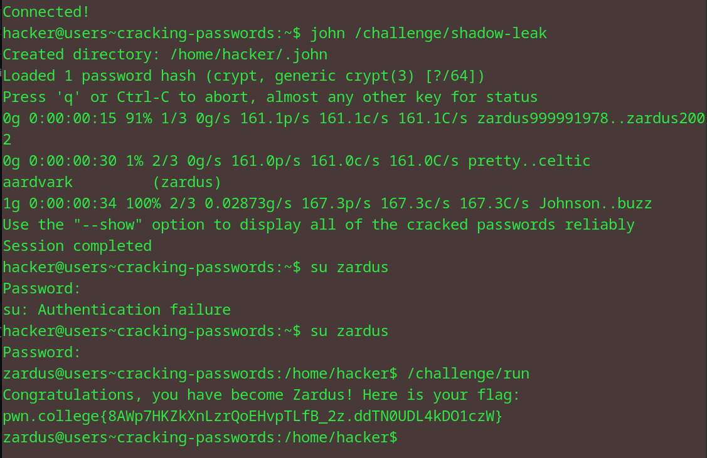

# Cracking Passwords
## Question
This level simulates this story, giving you a leak of /etc/shadow (in /challenge/shadow-leak). Crack it (this could take a few minutes), su to zardus, and run /challenge/run to get the flag!

## Solution

1. use the john the ripper program to decrypt the hashed password for zardus that was hacked
2. switch the user to zardus by using the password obtained (aardvark)
3. run the challenge/run program to get the flag

flag: pwn.college{8AWp7HKZkXnLzrQoEHvpTLfB_2z.ddTN0UDL4kDO1czW}

