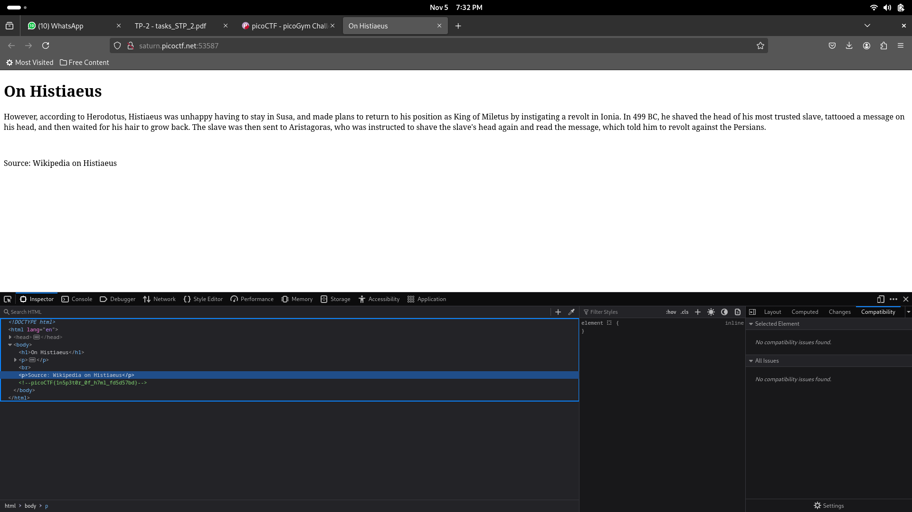

# Inspect HTML
Can you get the flag? Go to [this](http://saturn.picoctf.net:56954/) website and see what you can discover.

## Approach

You can inspect the given webpage's elements. When you click on 'Inspect' and go to the Inspector tab, you can see the flag embedded in the code as a comment.

### Flag: picoCTF{1n5p3t0r_0f_h7ml_fd5d57bd}
