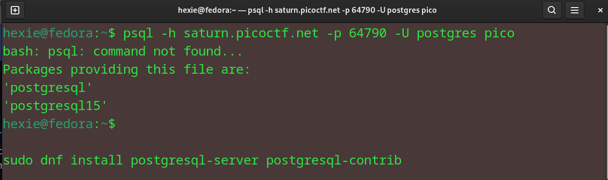
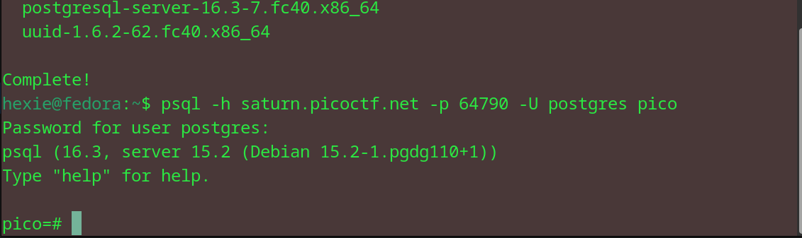
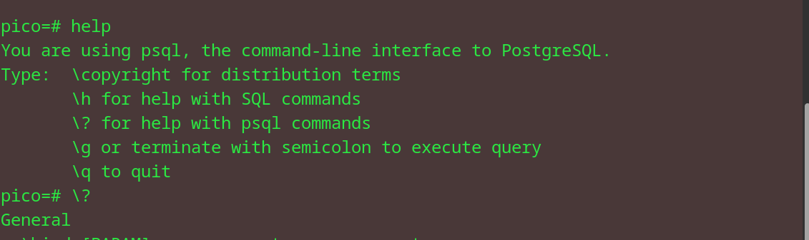
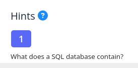
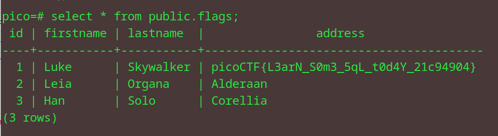

# SQL Direct
Connect to this PostgreSQL server and find the flag! psql -h saturn.picoctf.net -p 64790 -U postgres pico
Password is postgres

## Approach

I didn't have postgresql so I had to install it first.

Then, I ran the command given in the question and entered the password given.

Went to the help page, and then went to the help for psql commands. 

I did not know which command to use so I looked at the hint, and a couple references and figured out I had to use the list tables command. 

Searched for that command and entered it on the terminal.

Then, I ran the select command from the flags table on the public schema, and obtained the flag.

### flag: picoCTF{L3arN_S0m3_5qL_t0d4Y_21c94904}

