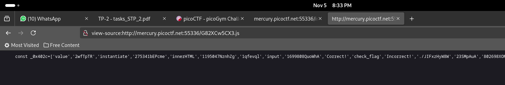
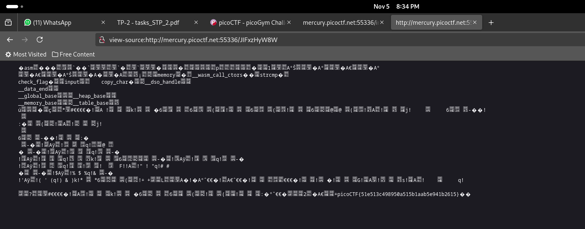

# Some Assembly Required 1
[link](http://mercury.picoctf.net:55336/index.html)

## Approach

If we view the source of the page, after the parts that we can read (like 'Incorrect!'), we see that there is an executable file part that we can append to the url and try out to see what happens. 

When we do that and go to the required url, we can see that the flag is clearly appended at the end of the code that pops up after a bunch of code that you cannot read through. 

### flag: picoCTF{51e513c498950a515b1aab5e941b2615}
