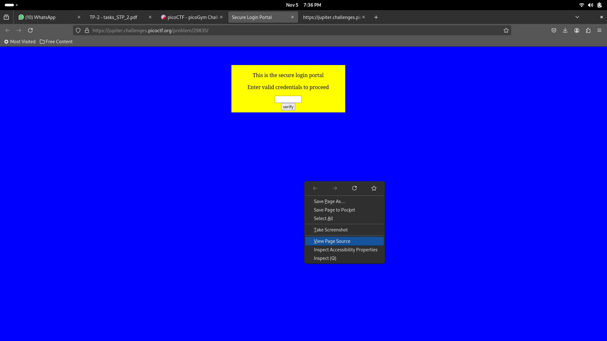
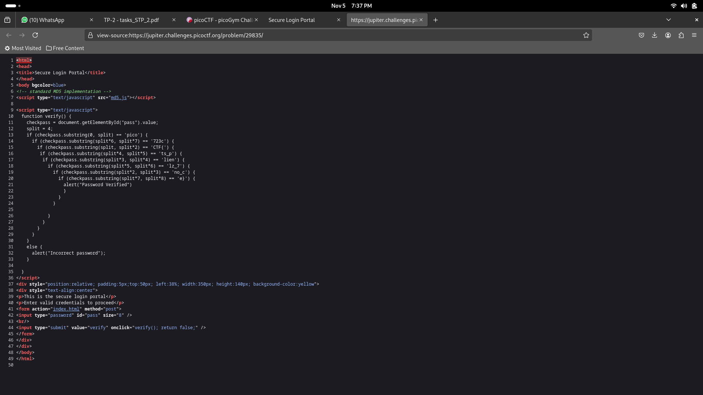

# dont-use-client-side
Can you break into this super secure portal? [link](https://jupiter.challenges.picoctf.org/problem/29835/)

## Approach

You're taken to a webpage as shown above. You can go to the page source and right there, you can see the flag split into 8 different code lines.

The flag can be obtained by piecing together the flag using the first substring argument for each line (the numbers correlate to the substring's position in the flag).

### Flag: picoCTF{no_clients_plz_7723ce}
